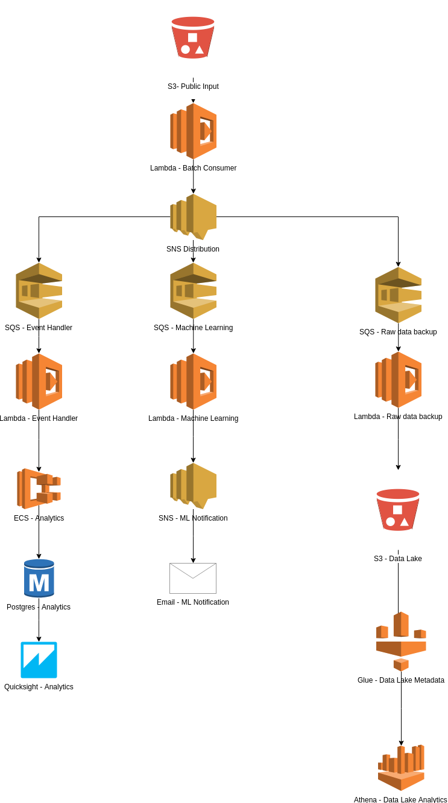

# Project: Real Estate Analysis

This project takes Real Estate data (in JSON format) in, and then process it in 3 different pipelines.

The architecture was built using Amazon Web Services. The overall architecture looks like this:

### Pipeline: The Beginning

The architecture starts with a S3 bucket that receives JSON files (one object per file). When a file is created, a Lambda function is triggered. The JSON object is loaded from S3 to a SNS distribution stream. Many subscribers can read from SNS and process this data.

### The three pipelines

There are 3 planned pipelines, but only one implemented by now (the Analytics Pipeline):

- Analytics Pipeline (the left wing):
  - SQS receives event from SNS
  - Lambda is triggered by SQS and then inserts event in database
  - RDS database can have a data warehouse schema to store the data
  - Quicksight reads database to create dashboards with metrics

- Machine Learning Pipeline (the center wing):
  - SQS receives event from SNS
  - Lambda is triggered by SQS and then uses the event to predict a value
  - If the the value is below a threshold (e.g.: price is under the regular price of a given real estate in the same category) then a message is sent to SNS
  - SNS sends an email with the undervalued real estate information

- Data Lake Pipeline (the right wing):
  - SQS receives event from SNS
  - Lambda is triggered by SQS and then inserts the raw event in the data lake (S3)
  - Metadata can be collected by AWS Glue
  - Files in S3 can be queried by Athena, using metadata in Glue

### Recreating the Analytics Pipeline
  - Use the CloudFormation template to create the stack in AWS [here](analytics/CloudFormation-Stack_Template.json)
  - Recreate the Lambdas:
    - The first Lambda function can be found [here](analytics/lambda_input)
    - The second Lambda function can be found [here](analytics/lambda_event)
  - Recreate the database:
    - The data warehouse schema can be found [here](analytics/db_create.sql)

### Executing the pipeline
  - A JSON file, with only one object per file, must be placed in the public S3 bucket.
  - The JSON event will be consumed by the pipeline as described above
  - The JSON event can be found at the event table in RDS
  - A graphic with event counts can be found in Quicksight
  
